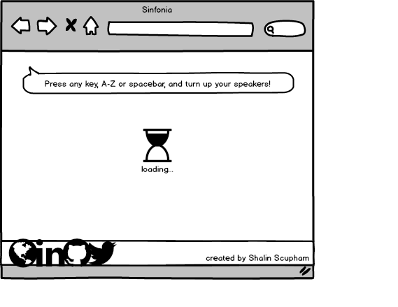
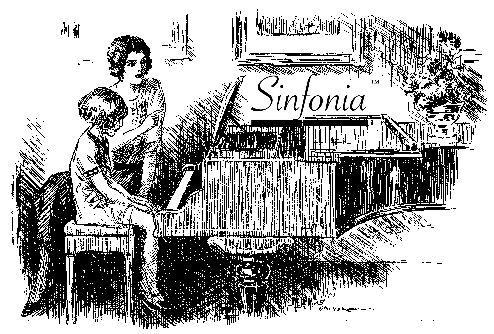

# Sinfonia
___
#### Background
This app transforms unassuming button presses in to eruptions of electronic sound, movement, form, and color dancing across the screen.  The aesthetic is destined to be minimal and lo-fi electronic tinged, while also bringing in occasional notes of classical music.

Heavily inspired by [Patatap](https://patatap.com/), a creation of the very talented [Jono Brandel](http://jonobr1.com/)

Animation style also influenced by some of the wilder 140 character code-golfed generative animations from [Dwitter](https://www.dwitter.net/).  Also a big fan of actual drum machines & the [Muscle Music](http://www.digitaltrainingacademy.com/casestudies/2012/08/old_spice_video_case_study_mus.php) soundboard / advertising campaign that Weiden & Kennedy made for Old Spice.

More than just another soundboard app!  It's a __multimedia interactive eperience™__  

Not related to [Synfonia](https://www.rms.biz/products/Sinfonia/).

#### Functionality & MVP
With Sinfonia Gutenberg, users will be able to:

* Trigger compelling animation and make beautiful sound on button presses. Experience the joy of typing like it's the very first time!
* Experience a minimum of 26 distinct sounds and animations
* Minimize boredom and extend play time with dynamically generated direction, color, intensity, and path of the animations for semi-unpredictable behavior

In addition, this project will include:
* A production README
(you're reading it)
* Sufficient sound warning, a prompt to press keys to make noise
* Prominent advertising for the developer

#### Wireframes

The app will run in full screen, with a button to maximize to the full width of the browser window.  Design is pretty simple, everything assumes an arbitrarily large screen.  

Author information and directions show for game will display during load in a bottom bar that disappears after about five seconds.  Game loads with simple instructions to press a key and turn up your headphones.  Credits bar reappears on mouse movement.  

#### Architecture & Technologies
The project will be implemented with the following technologies:

* Event listeners in vanilla JS

* Sound playing via HTML5 <audio> element.

* Sound hosting is MP3's on AWS for faster load times and universal browser compatibility.

* App hosting on Heroku and Git

* Animations are probably the bulk of the work and will be created with as much pure JavaScript and CSS3 as possible.  paper.js and anime.js are strong contenders for being at least inspiration libraries on the Javascript side, while Animate.css and the Sass keyframes mixins may help with some of the lower level CSS concerns.

Especially interested in creating flocking behaviors / particle effects with Object Oriented JS

"Objects in Paper make it easy to extend parent objects and run constructor functions without having to worry about JavaScript prototypal inheritance. Because of this it is easy to make compound drawing objects with their own instance variables and behaviors. [Example: each swimming tadpole follows its own behavior](http://paperjs.org/examples/tadpoles/) These features make it easier to create objects that can act autonomously with complex behaviors."

#### Implementation Timeline

** Day 1 **: Back end & container day.  Setup a simple hosted page that changes the background color randomly with a sound effect on a button press and has links to personal web presence.  Prefetch media.  Placeholder loading content.  Set automatic focus on page load.  Self promotion footer and instructions tool tip designed & implemented.  

** Day 2 **: Audio sample pack curated and keymapped to alphabetic keys. Start in on animations, iterate a couple approached on loading animation or a simple animation to experiment with tooling & libraries.  Finalize color scheme.

** Day 3 & beyond **: Animations, animations, animations, animations. If these aren't super clean, the app feels off.

#### Bonus Features

There are many directions this app could eventually go.  Some dreams:

* Preload page / self promotional footer has shadow-casting animations like on http://goodgameclub.studiomoniker.com/
* Expand animations to 50 or so by including punctuation and numbers on keyboard.
* Mobile / touch responsive version would overlay screen with responsive grid of simple clickable / touch responsive invisible boxes when site is accessed by a mobile device.
* Color scheme and sound bank content change on spacebar press

### Thanks For Reading!

